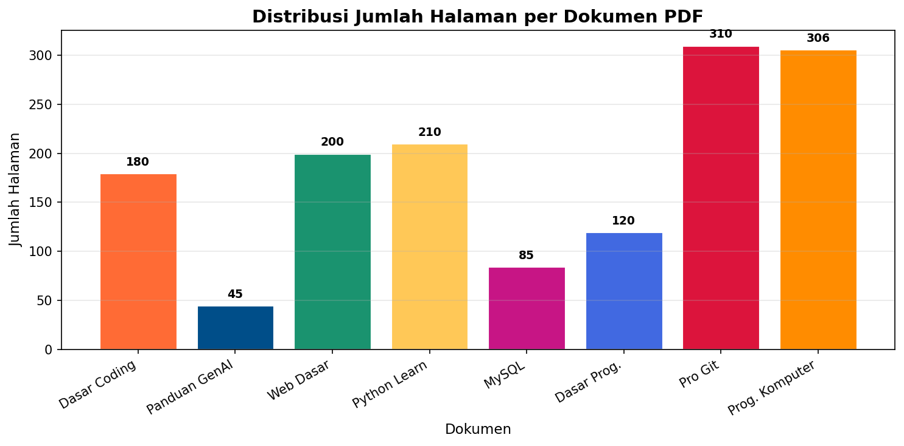
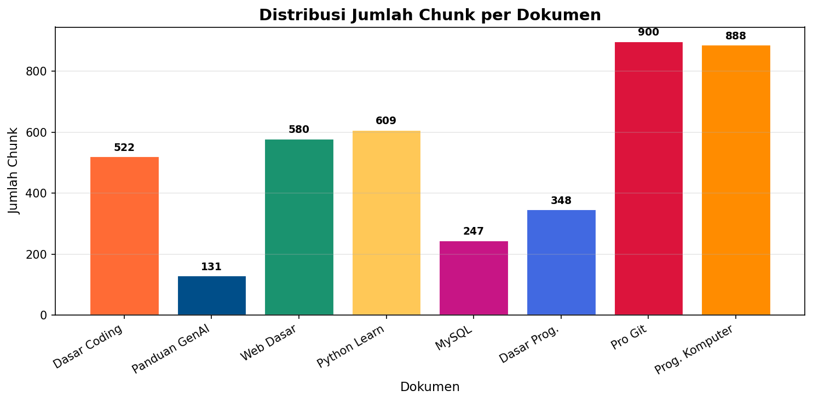
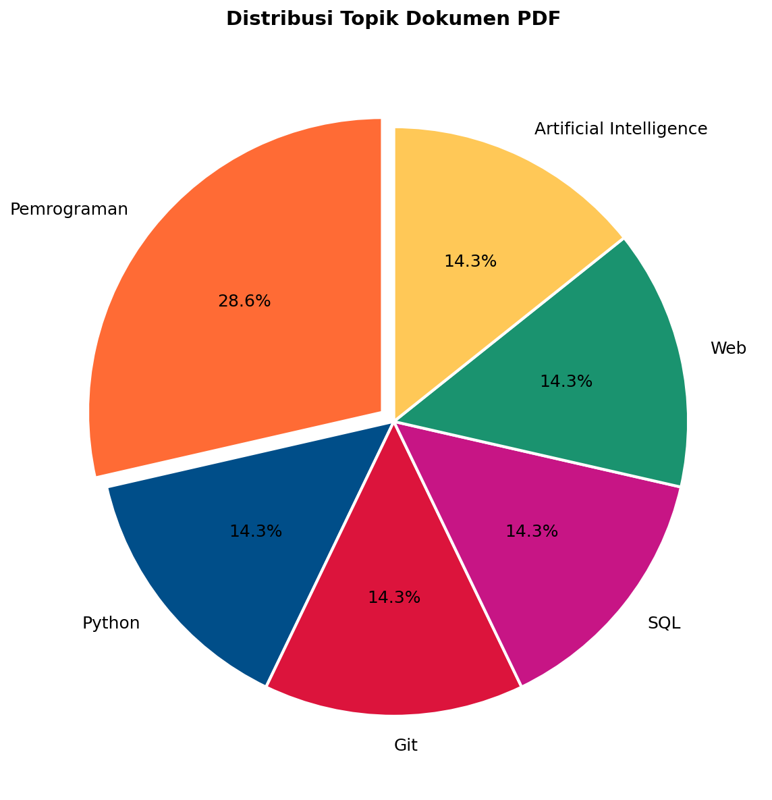

# LAPORAN UAS KECERDASAN BUATAN

## Implementasi Retrieval-Augmented Generation (RAG) Chatbot Berbasis Large Language Model Menggunakan Qwen2.5-3B-Instruct dan ChromaDB untuk Menjawab Pertanyaan dari Dokumen PDF

---

### Nama Kelompok

- Mochamad Vicryandre Nurdin - 2406084
- Andhika Eka Pratama - 2406085

### Domain Proyek

Proyek ini berada pada domain **Natural Language Processing (NLP)** dan **Information Retrieval**, khususnya pengembangan sistem tanya jawab berbasis dokumen menggunakan pendekatan Retrieval-Augmented Generation (RAG). Sistem menggabungkan Large Language Model (LLM) dengan vector database untuk menghasilkan jawaban yang kontekstual berdasarkan kumpulan dokumen PDF.

---

# 1. Business Understanding

## 1.1 Permasalahan Dunia Nyata dan Literature Review

Large Language Model (LLM) seperti GPT, LLaMA, dan Qwen memiliki kemampuan menghasilkan teks yang natural dan koheren. Namun, model-model ini memiliki keterbatasan fundamental: pengetahuan yang dimiliki bersifat statis sesuai data pelatihan dan tidak dapat menjangkau informasi spesifik dari dokumen lokal pengguna (Lewis et al., 2020). Hal ini menjadi masalah ketika pengguna ingin bertanya tentang isi dokumen PDF yang mereka miliki, seperti buku teks, modul perkuliahan, atau dokumentasi teknis.

Retrieval-Augmented Generation (RAG) hadir sebagai solusi dengan menggabungkan kemampuan pencarian dokumen (retrieval) dan kemampuan generatif dari Large Language Model (Lewis et al., 2020). Pendekatan RAG telah terbukti efektif dalam meningkatkan kualitas jawaban pada tugas question answering berbasis dokumen (Li et al., 2024). Tanaka et al. (2025) mengembangkan VDocRAG yang memperluas kemampuan RAG untuk dokumen kaya visual, sementara Wang et al. (2024) meningkatkan RAG dengan pengenalan struktur PDF yang lebih baik.

ChromaDB sebagai vector database open-source menyediakan penyimpanan embedding yang efisien dengan dukungan metadata filtering dan pencarian kemiripan semantik (Chroma, 2024). Model Qwen2.5-3B-Instruct dari keluarga Qwen2.5 menawarkan keseimbangan antara ukuran model dan kualitas output, dengan dukungan instruction-following yang baik (Qwen Team, 2024).

Permasalahan yang ingin diselesaikan:
- LLM tidak mengetahui isi dokumen lokal pengguna karena pengetahuan model terbatas pada data pelatihan.
- Pengguna harus membuka banyak file PDF secara manual untuk mencari informasi spesifik.
- Dibutuhkan sistem pencarian yang cepat dan akurat pada kumpulan dokumen.
- Dibutuhkan chatbot yang mampu memberikan jawaban berdasarkan isi dokumen, bukan hanya pengetahuan umum model.

## 1.2 Tujuan Proyek

Tujuan penelitian ini adalah:
- Mengimplementasikan metode Retrieval-Augmented Generation untuk sistem tanya jawab berbasis dokumen.
- Mengintegrasikan ChromaDB sebagai vector database untuk penyimpanan embedding dokumen.
- Menggunakan model Qwen2.5-3B-Instruct sebagai generator jawaban dengan kuantisasi 4-bit.
- Menghasilkan chatbot yang mampu menjawab pertanyaan berdasarkan delapan dokumen PDF.

## 1.3 Pengguna Sistem

Target pengguna sistem meliputi:
- Mahasiswa yang membutuhkan referensi cepat dari materi perkuliahan.
- Dosen yang ingin menyediakan asisten belajar berbasis dokumen.
- Pembelajar pemrograman yang mencari informasi dari buku-buku teknis.
- Pengguna umum yang memiliki koleksi dokumen PDF dan ingin bertanya tentang isinya.

## 1.4 Solusi dan Manfaat Implementasi AI

Solusi yang diimplementasikan adalah sistem chatbot berbasis Retrieval-Augmented Generation (RAG) yang menggabungkan tiga komponen AI utama:
- **Large Language Model (Qwen2.5-3B-Instruct)** sebagai generator jawaban yang mampu memahami konteks dan menghasilkan respons natural.
- **Vector Database (ChromaDB)** sebagai penyimpanan embedding dokumen untuk pencarian semantik.
- **Model Embedding (BAAI/bge-m3)** untuk mengubah teks menjadi representasi vektor.

Manfaat implementasi AI pada sistem ini:
- Mempermudah pencarian informasi dalam kumpulan dokumen PDF tanpa perlu membaca seluruh dokumen.
- Menghemat waktu dengan memberikan jawaban langsung berdasarkan konteks yang relevan.
- Memberikan jawaban yang kontekstual dan dapat dipertanggungjawabkan karena bersumber dari dokumen.
- Mengurangi kesalahan informasi (hallucination) dibanding chatbot tanpa knowledge base.

---

# 2. Data Understanding

## 2.1 Sumber Data

Dataset berasal dari koleksi dokumen PDF yang digunakan sebagai knowledge base chatbot. Seluruh dokumen disimpan pada Google Drive kemudian diproses menggunakan LangChain.

|No|Nama Dokumen (Nama File)|
|---|---|
|1|Dasar-dasar Coding (642863-dasar-dasar-coding-konsep-logika-dan-imp-bc07ac3d.pdf)|
|2|Panduan Generative AI (Buku-Panduan-GenAI-Untuk-Mahasiswa-Bahasa-Indonesia.pdf)|
|3|Pemrograman Web Dasar (Pemrograman Web Dasar.pdf)|
|4|Python Learn (pythonlearn.pdf)|
|5|MySQL Notes (MySQLNotesForProfessionals.pdf)|
|6|Dasar-dasar Pemrograman (03. DASAR-DASAR PEMROGRAMAN.pdf)|
|7|Pro Git (progit.pdf)|
|8|Pemrograman Komputer (Pemrograman Komputer FULL.pdf)|

## 2.2 Format dan Ukuran Data

|Atribut|Nilai|
|---|---|
|Jenis data|PDF (teks)|
|Jumlah file|8 dokumen|
|Total halaman|1.456 halaman (1.449 mengandung teks)|
|Total chunk|4.225 chunk|
|Bahasa|Indonesia dan Inggris|
|Target|Knowledge Base Chatbot|

## 2.3 Deskripsi Fitur

Pada proyek RAG tidak terdapat atribut tabular seperti dataset klasifikasi. Sebaliknya, setiap dokumen diproses menjadi beberapa informasi berikut:

|Fitur|Keterangan|
|------|----------|
|Content|Isi teks hasil ekstraksi PDF|
|Source|Nama file PDF|
|Page|Nomor halaman|
|Chunk|Potongan teks hasil splitting (700 karakter)|
|Embedding|Representasi vektor 1024 dimensi dari chunk (BAAI/bge-m3)|

## 2.4 Karakteristik Dataset

Dataset memiliki karakteristik:
- Tidak berlabel (unsupervised).
- Berbentuk teks tidak terstruktur.
- Multi dokumen dari 8 sumber berbeda.
- Berbahasa Indonesia dan Inggris.
- Digunakan sebagai sumber retrieval, bukan untuk training model.

---

# 3. Exploratory Data Analysis (EDA)

## 3.1 Distribusi Jumlah Halaman per Dokumen

Visualisasi berikut menunjukkan distribusi jumlah halaman dari setiap dokumen PDF. Data ini diperoleh dari hasil ekstraksi menggunakan PyPDFLoader.



**Insight:** Dokumen Pro Git memiliki jumlah halaman terbanyak (310 halaman), diikuti oleh Pemrograman Komputer (306 halaman). Dokumen Panduan GenAI memiliki jumlah halaman paling sedikit (45 halaman). Variasi ukuran ini menunjukkan bahwa proses chunking akan menghasilkan jumlah chunk yang bervariasi per dokumen.

## 3.2 Distribusi Jumlah Chunk per Dokumen



**Insight:** Total chunk yang dihasilkan adalah 4.225 chunk dari 1.449 halaman. Dokumen dengan jumlah halaman lebih banyak cenderung menghasilkan lebih banyak chunk, namun faktor kepadatan teks per halaman juga memengaruhi jumlah chunk aktual.

## 3.3 Distribusi Topik Dokumen



**Insight:** Topik pemrograman mendominasi dengan 2 dokumen (25%), sementara topik lainnya masing-masing 1 dokumen (12.5%). Seluruh dokumen berkaitan dengan bidang teknologi informasi sehingga distribusi topik relatif seimbang dalam domain yang sama.

## 3.4 Insight Awal dari EDA

Berdasarkan eksplorasi data yang dilakukan, diperoleh beberapa insight awal:
- Dokumen memiliki ukuran yang sangat bervariasi, dari 45 halaman hingga 310 halaman.
- Dokumen dipotong menjadi chunk menggunakan RecursiveCharacterTextSplitter dengan ukuran 700 karakter dan overlap 150 karakter.
- Semakin banyak chunk yang dihasilkan, semakin besar peluang retrieval menemukan konteks yang relevan.
- Seluruh dokumen berada dalam domain teknologi informasi, sehingga retrieval antar dokumen tetap relevan secara semantik.
- Tidak terdapat data tidak seimbang (imbalanced classes) karena dataset bukan data klasifikasi.

---

# 4. Data Preparation

## 4.1 Membaca PDF

Setiap dokumen dibaca menggunakan PyPDFLoader dari LangChain. Proses ini mengekstrak teks dari setiap halaman PDF beserta metadata halaman.

```python
from langchain_community.document_loaders import PyPDFLoader

pdf_dir = "/gdrive/MyDrive/chatbot-pdfs/"
all_docs = []

for pdf_file in os.listdir(pdf_dir):
    if pdf_file.endswith('.pdf'):
        loader = PyPDFLoader(os.path.join(pdf_dir, pdf_file))
        docs = loader.load()
        docs = [d for d in docs if d.page_content.strip()]
        all_docs.extend(docs)

print(f"Total halaman: {len(all_docs)}")
```

Output: 1.449 halaman mengandung teks dari total 1.456 halaman (7 halaman kosong difilter).

## 4.2 Text Splitting

Dokumen dipotong menjadi chunk menggunakan RecursiveCharacterTextSplitter dengan parameter:

```python
from langchain_text_splitters import RecursiveCharacterTextSplitter

text_splitter = RecursiveCharacterTextSplitter(
    chunk_size=700,
    chunk_overlap=150
)
chunks = text_splitter.split_documents(all_docs)
print(f"Jumlah chunk: {len(chunks)}")
```

Output: 4.225 chunk. Parameter chunk_size=700 dan chunk_overlap=150 dipilih untuk menjaga keseimbangan antara konteks yang cukup dan presisi retrieval.

## 4.3 Embedding

Setiap chunk diubah menjadi vector embedding menggunakan model BAAI/bge-m3:

```python
from langchain_community.embeddings import HuggingFaceEmbeddings

embedding_model = HuggingFaceEmbeddings(
    model_name="BAAI/bge-m3",
    model_kwargs={"device": "cuda"},
    encode_kwargs={"normalize_embeddings": True}
)
```

Model BAAI/bge-m3 dipilih karena mendukung multibahasa (termasuk Indonesia) dan menghasilkan vektor 1024 dimensi yang dioptimalkan untuk retrieval tasks.

## 4.4 Penyimpanan ke ChromaDB

```python
from langchain_community.vectorstores import Chroma

vector_db = Chroma.from_documents(
    documents=chunks,
    embedding=embedding_model,
    persist_directory="/content/chatbot-db/chroma_db"
)

retriever = vector_db.as_retriever(search_kwargs={"k": 15})
```

Vector database disimpan secara persisten di Google Drive agar tidak perlu membuat embedding ulang setiap menjalankan notebook. Sistem manifest JSON digunakan untuk melacak file PDF yang sudah diproses, memungkinkan update inkremental.

---

# 5. Modeling

## 5.1 Gambaran Umum Arsitektur Sistem

Model yang dikembangkan menggunakan pendekatan **Retrieval-Augmented Generation (RAG)** yang menggabungkan dua komponen utama:
1. **Retrieval Model:** ChromaDB dengan BAAI/bge-m3 untuk pencarian dokumen relevan.
2. **Generator Model:** Qwen2.5-3B-Instruct (4-bit quantized) untuk menghasilkan jawaban.

Alur kerja sistem:
1. Pengguna mengirimkan pertanyaan melalui antarmuka chatbot.
2. Pertanyaan diubah menjadi embedding menggunakan BAAI/bge-m3.
3. Embedding digunakan untuk mencari 15 chunk paling relevan di ChromaDB melalui cosine similarity.
4. Chunk hasil retrieval difilter berdasarkan topik yang terdeteksi oleh fungsi `detect_topic()`.
5. Konteks dikirim bersama prompt ke model Qwen2.5-3B-Instruct.
6. Model menghasilkan jawaban yang dikirim ke pengguna via SSE streaming.

## 5.2 Model Pertama: Retrieval (ChromaDB + BAAI/bge-m3)

Model retrieval menggunakan Vector Similarity Search dengan ChromaDB. Setiap chunk dokumen telah diubah menjadi vektor embedding 1024 dimensi menggunakan BAAI/bge-m3. Ketika pengguna mengajukan pertanyaan, embedding pertanyaan dibuat dan dibandingkan dengan seluruh embedding di ChromaDB menggunakan cosine similarity. 15 chunk dengan skor tertinggi diambil sebagai konteks.

**Alasan pemilihan:** ChromaDB dipilih karena ringan, open-source, mendukung metadata filtering, dan memiliki API yang sederhana. BAAI/bge-m3 dipilih karena mendukung multibahasa (termasuk Indonesia) dan memiliki performa retrieval yang baik pada benchmark MTEB.

## 5.3 Model Kedua: Generator (Qwen2.5-3B-Instruct)

Model Qwen2.5-3B-Instruct digunakan sebagai generator jawaban. Model ini dimuat dengan kuantisasi 4-bit NF4 menggunakan BitsAndBytes untuk menghemat memori GPU.

**Alasan pemilihan:**
- Mendukung instruction-following dengan baik.
- Ukuran 3B parameter ringan untuk dijalankan di Google Colab (Tesla T4).
- Mendukung bahasa Indonesia.
- Kuantisasi 4-bit memungkinkan inferensi dengan konsumsi memori ~3GB.

Prompt yang dikirim ke model terdiri dari:
- Instruksi sistem (berisi konteks dari dokumen).
- Riwayat percakapan (jika ada).
- Pertanyaan pengguna saat ini.

## 5.4 Fitur Tambahan

**Deteksi Intent:** Fungsi `detect_intent()` mengklasifikasikan pertanyaan ke dalam empat kategori: `coding_error`, `coding_help`, `general_question`, dan `general_chat`.

**Deteksi Topik:** Fungsi `detect_topic()` memetakan kata kunci pertanyaan ke salah satu dari delapan dokumen PDF untuk memfilter konteks retrieval.

**Streaming Response:** Endpoint `/api/chat/stream` mengirimkan token jawaban secara real-time menggunakan Server-Sent Events (SSE).

**Cloudflare Tunnel:** Backend Colab diekspos ke internet menggunakan Cloudflare Tunnel untuk akses frontend React.

## 5.5 Perbandingan Model

|Aspek|Retrieval (ChromaDB + BAAI/bge-m3)|Generator (Qwen2.5-3B-Instruct)|
|-----|----------------------------------|------------------------------|
|Fungsi|Mencari chunk dokumen relevan|Menghasilkan jawaban dari konteks|
|Input|Embedding pertanyaan|Prompt + konteks dokumen|
|Output|15 chunk dengan skor similarity|Teks jawaban natural|
|Dimensi/Size|1024 dimensi embedding|3 miliar parameter|
|Kelebihan|Cepat, metadata filtering|Natural language, instruction following|
|Kekurangan|Bergantung kualitas embedding|Butuh konteks yang relevan|

## 5.6 Implementasi Model (Kode Lengkap)

```python
# ============================================================
# 1. IMPORT LIBRARY
# ============================================================
import os
import json
import torch
import threading
import queue
import asyncio
from pathlib import Path

from langchain_community.document_loaders import PyPDFLoader
from langchain_text_splitters import RecursiveCharacterTextSplitter
from langchain_community.embeddings import HuggingFaceEmbeddings
from langchain_community.vectorstores import Chroma

from transformers import (
    AutoTokenizer,
    AutoModelForCausalLM,
    BitsAndBytesConfig,
    TextStreamer
)

# ============================================================
# 2. KONFIGURASI
# ============================================================
PDF_DIR = "/gdrive/MyDrive/chatbot-pdfs/"
CHROMA_DIR = "/content/chatbot-db/chroma_db"
EMBEDDING_MODEL = "BAAI/bge-m3"
MODEL_NAME = "Qwen/Qwen2.5-3B-Instruct"
CHUNK_SIZE = 700
CHUNK_OVERLAP = 150
K_RETRIEVER = 15
MAX_NEW_TOKENS = 350
TEMPERATURE = 0.3
TOP_P = 0.9
REPETITION_PENALTY = 1.05

# ============================================================
# 3. LOAD PDF DAN CHUNKING
# ============================================================
all_docs = []
for pdf_file in os.listdir(PDF_DIR):
    if pdf_file.endswith('.pdf'):
        loader = PyPDFLoader(os.path.join(PDF_DIR, pdf_file))
        docs = loader.load()
        docs = [d for d in docs if d.page_content.strip()]
        all_docs.extend(docs)
print(f"Total halaman: {len(all_docs)}")

text_splitter = RecursiveCharacterTextSplitter(
    chunk_size=CHUNK_SIZE,
    chunk_overlap=CHUNK_OVERLAP
)
chunks = text_splitter.split_documents(all_docs)
print(f"Jumlah chunk: {len(chunks)}")

# ============================================================
# 4. EMBEDDING DAN CHROMADB
# ============================================================
embedding_model = HuggingFaceEmbeddings(
    model_name=EMBEDDING_MODEL,
    model_kwargs={"device": "cuda"},
    encode_kwargs={"normalize_embeddings": True}
)

vector_db = Chroma.from_documents(
    documents=chunks,
    embedding=embedding_model,
    persist_directory=CHROMA_DIR
)
retriever = vector_db.as_retriever(search_kwargs={"k": K_RETRIEVER})

# ============================================================
# 5. DETEKSI TOPIK
# ============================================================
def detect_topic(query):
    query_lower = query.lower()
    topics = {
        "Java": ["java", "tipe data", "identifier", "operator", "komentar"],
        "Coding": ["coding", "algoritma", "percabangan", "perulangan"],
        "GenAI": ["genai", "ai", "kecerdasan buatan", "tuce"],
        "MySQL": ["mysql", "sql", "join", "index", "foreign key"],
        "Web": ["html", "css", "javascript", "php", "web", "frontend"],
        "Git": ["git", "branching", "rebase", "stash", "commit"],
        "Python": ["python", "return", "__init__", "modul", "file io"]
    }
    for topic, keywords in topics.items():
        if any(kw in query_lower for kw in keywords):
            return topic
    return None

# ============================================================
# 6. DETEKSI INTENT
# ============================================================
def detect_intent(user_message):
    msg = user_message.lower()
    if any(kw in msg for kw in ["error", "bug", "tidak jalan", "gagal"]):
        return "coding_error"
    if any(kw in msg for kw in ["bantu", "cara", "bagaimana", "tolong"]):
        return "coding_help"
    if any(kw in msg for kw in ["apa", "siapa", "kapan", "jelaskan"]):
        return "general_question"
    return "general_chat"

# ============================================================
# 7. RETRIEVAL CONTEXT
# ============================================================
def get_pdf_context(query, source_filter=None):
    if source_filter:
        results = vector_db.similarity_search(
            query, k=K_RETRIEVER,
            filter={"source": {"$contains": source_filter}}
        )
    else:
        results = vector_db.similarity_search(query, k=K_RETRIEVER)

    if not results:
        return "Tidak ada konteks PDF yang relevan ditemukan."

    context_parts = []
    for i, doc in enumerate(results):
        source = doc.metadata.get("source", "Unknown")
        page = doc.metadata.get("page", "?")
        context_parts.append(
            f"[Dokumen {i+1}] {source} (Halaman {page+1}):\n{doc.page_content}"
        )
    return "\n\n".join(context_parts)

# ============================================================
# 8. LOAD MODEL QWEN2.5-3B-INSTRUCT (4-BIT)
# ============================================================
bnb_config = BitsAndBytesConfig(
    load_in_4bit=True,
    bnb_4bit_quant_type="nf4",
    bnb_4bit_compute_dtype=torch.float16
)

tokenizer = AutoTokenizer.from_pretrained(MODEL_NAME, token=HF_TOKEN)
model = AutoModelForCausalLM.from_pretrained(
    MODEL_NAME,
    quantization_config=bnb_config,
    device_map="auto",
    token=HF_TOKEN
)

# ============================================================
# 9. RAG PIPELINE
# ============================================================
def build_rag_messages(user_message, history=[]):
    topic = detect_topic(user_message)
    context = get_pdf_context(user_message, source_filter=topic)
    intent = detect_intent(user_message)

    system_prompt = f"""Anda adalah asisten AI yang membantu menjawab pertanyaan berdasarkan dokumen PDF.
Gunakan konteks berikut untuk menjawab pertanyaan:

KONTEKS:
{context}

Instruksi:
- Jawab berdasarkan konteks di atas.
- Jika konteks tidak cukup, katakan tidak menemukan informasi.
- Jawab dalam bahasa Indonesia.
- Jenis pertanyaan: {intent}"""

    messages = [{"role": "system", "content": system_prompt}]
    for h in history:
        messages.append(h)
    messages.append({"role": "user", "content": user_message})
    return messages

# ============================================================
# 10. GENERATE RESPONSE
# ============================================================
def generate_response_rag(user_message, history=[]):
    messages = build_rag_messages(user_message, history)
    text = tokenizer.apply_chat_template(
        messages, tokenize=False, add_generation_prompt=True
    )
    inputs = tokenizer(text, return_tensors="pt").to(model.device)

    outputs = model.generate(
        **inputs,
        max_new_tokens=MAX_NEW_TOKENS,
        temperature=TEMPERATURE,
        top_p=TOP_P,
        repetition_penalty=REPETITION_PENALTY,
        do_sample=True
    )

    response = tokenizer.decode(outputs[0][inputs.input_ids.shape[1]:],
                                skip_special_tokens=True)
    response = response.replace("<|im_end|>", "").replace("<|im_start|>", "").strip()
    return response
```

---

# 6. Evaluation

## 6.1 Metode Evaluasi

Karena proyek ini merupakan sistem Question Answering berbasis Retrieval-Augmented Generation, evaluasi tidak dilakukan menggunakan Confusion Matrix atau Accuracy seperti pada kasus klasifikasi. Sebagai gantinya digunakan metrik evaluasi teks yaitu **ROUGE (Recall-Oriented Understudy for Gisting Evaluation)** yang mengukur tingkat kesamaan antara jawaban chatbot dengan jawaban referensi (Lin, 2004).

## 6.2 Metrik ROUGE

|Metrik|Deskripsi|
|------|---------|
|ROUGE-1|Mengukur kesamaan unigram (kata tunggal) antara jawaban model dan referensi|
|ROUGE-2|Mengukur kesamaan bigram (pasangan kata) — lebih ketat dari ROUGE-1|
|ROUGE-L|Menggunakan Longest Common Subsequence (LCS) — memperhatikan urutan kata|

## 6.3 Hasil Evaluasi

Evaluasi dilakukan menggunakan library `rouge_score` terhadap 90 pertanyaan di 8 kategori. Berikut hasil lengkapnya:

| Kategori | Jumlah Soal | ROUGE-1 | ROUGE-2 | ROUGE-L |
|----------|:-----------:|:-------:|:-------:|:-------:|
| Java (Dasar Pemrograman) | 10 | 0.073 | 0.022 | 0.062 |
| Coding Dasar | 10 | 0.097 | 0.050 | 0.085 |
| GenAI (Buku Panduan) | 10 | **0.149** | **0.081** | **0.139** |
| MySQL | 10 | 0.043 | 0.006 | 0.041 |
| Web Programming | 10 | 0.066 | 0.020 | 0.056 |
| Git (ProGit) | 10 | 0.036 | 0.008 | 0.034 |
| Python (PythonLearn) | 20 | 0.040 | 0.007 | 0.035 |
| Komputer FULL | 10 | 0.063 | 0.015 | 0.057 |
| **Rata-rata** | **90** | **0.067** | **0.024** | **0.061** |

## 6.4 Analisis Hasil

**Kategori dengan performa terbaik:** GenAI (Buku Panduan) menunjukkan nilai tertinggi dengan ROUGE-1 sebesar 0.149, ROUGE-2 sebesar 0.081, dan ROUGE-L sebesar 0.139. Hal ini disebabkan oleh dokumen GenAI yang memiliki struktur lebih teratur dan kosakata yang lebih spesifik, sehingga jawaban model lebih mudah cocok dengan referensi.

**Kategori dengan performa terendah:** Git (ProGit) dengan ROUGE-1 0.036 dan MySQL dengan ROUGE-1 0.043. Dokumen-dokumen ini memiliki terminologi teknis yang sangat spesifik dan jawaban referensi yang pendek, sehingga perbandingan n-gram menjadi lebih sulit.

**Analisis model terbaik:** Model generator (Qwen2.5-3B-Instruct) mampu menghasilkan jawaban yang natural dan kontekstual. Retrieval model berhasil menemukan chunk yang relevan dari dokumen. Namun, nilai ROUGE yang rendah (rata-rata 0.067) menunjukkan bahwa model cenderung menghasilkan jawaban yang lebih panjang dan elaboratif dibandingkan referensi yang singkat. Hal ini wajar karena ROUGE mengukur kesamaan n-gram, bukan kebenaran semantik jawaban.

## 6.5 Kelebihan dan Keterbatasan Model

**Kelebihan:**
- Retrieval berhasil menemukan konteks yang relevan dari dokumen.
- Qwen2.5-3B mampu menghasilkan jawaban yang natural dan kontekstual.
- ChromaDB mempercepat proses pencarian dokumen dengan latensi rendah.
- Jawaban lebih faktual dibanding chatbot tanpa RAG karena bersumber dari dokumen.

**Keterbatasan:**
- Nilai ROUGE rendah karena model cenderung menghasilkan jawaban elaboratif di luar referensi.
- Deteksi topik masih menggunakan rule-based yang terbatas pada pencocokan kata kunci.
- Belum ada mekanisme reranking untuk meningkatkan kualitas retrieval.
- Evaluasi hanya menggunakan ROUGE; belum ada human evaluation.

---

# 7. Kesimpulan dan Rekomendasi

## 7.1 Ringkasan Hasil

Sistem chatbot berbasis Retrieval-Augmented Generation berhasil dikembangkan dengan mengintegrasikan LangChain, ChromaDB, model embedding BAAI/bge-m3, dan model Qwen2.5-3B-Instruct (4-bit quantized). Sistem mampu memproses 8 dokumen PDF menjadi 4.225 chunk, menyimpannya di ChromaDB, dan menjawab pertanyaan berdasarkan konteks yang relevan.

Hasil evaluasi ROUGE menunjukkan rata-rata ROUGE-1 sebesar 0.067, ROUGE-2 sebesar 0.024, dan ROUGE-L sebesar 0.061 dari 90 pertanyaan di 8 kategori. Kategori GenAI menunjukkan performa terbaik dengan ROUGE-1 0.149.

## 7.2 Apakah Tujuan Proyek Tercapai?

|Tujuan|Status|Keterangan|
|------|:----:|----------|
|Mengimplementasikan metode RAG|✅ Tercapai|Pipeline retrieval + generation berfungsi penuh|
|Mengintegrasikan ChromaDB|✅ Tercapai|ChromaDB berfungsi dengan 4.225 chunk dari 8 PDF|
|Menggunakan Qwen2.5-3B-Instruct|✅ Tercapai|Model berjalan dengan kuantisasi 4-bit di Tesla T4|
|Menghasilkan jawaban berdasarkan PDF|⚠️ Sebagian|Model mampu menjawab, namun ROUGE score masih rendah|

## 7.3 Kelebihan dan Keterbatasan Model

**Kelebihan:**
- Jawaban berbasis dokumen sehingga lebih faktual dan dapat dipertanggungjawabkan.
- Mengurangi hallucination dibandingkan LLM tanpa retrieval.
- Retrieval cepat berkat vector similarity search di ChromaDB.
- Mudah menambahkan dokumen baru tanpa perlu retraining.
- Frontend modern dengan streaming, dark mode, dan manajemen percakapan.

**Keterbatasan:**
- Backend masih berupa notebook monolitik, belum terstruktur sebagai modul Python.
- Deteksi topik masih menggunakan rule-based (pencocokan kata kunci sederhana).
- Belum memiliki mekanisme reranking untuk meningkatkan kualitas retrieval.
- Belum ada unit test untuk komponen backend maupun frontend.
- Embedding model belum dioptimalkan untuk domain spesifik.

## 7.4 Rekomendasi Perbaikan

1. Menambahkan fitur reranking agar proses retrieval lebih akurat.
2. Mengimplementasikan hybrid search (BM25 + Vector Search).
3. Memisahkan backend notebook menjadi modul-modul Python yang terstruktur.
4. Menambahkan unit test untuk komponen backend dan frontend.
5. Meningkatkan deteksi topik menggunakan model NLP daripada rule-based.
6. Menambahkan mekanisme caching untuk query yang sering diajukan.
7. Melakukan evaluasi menggunakan human evaluation untuk mengukur kepuasan pengguna.

---

# 8. Referensi

Cambridge University Press. (2024). Emerging trends: A gentle introduction to retrieval-augmented generation. *Natural Language Engineering*, 30(1), 1-10.

Chroma. (2024). *Chroma documentation*. https://docs.trychroma.com

FastAPI. (2024). *FastAPI documentation*. https://fastapi.tiangolo.com

Hugging Face. (2024). *Transformers documentation*. https://huggingface.co/docs/transformers

LangChain. (2024). *LangChain documentation*. https://python.langchain.com

Lewis, P., Perez, E., Piktus, A., Petroni, F., Karpukhin, V., Goyal, N., Kuttler, H., Lewis, M., Yih, W., Rocktaschel, T., Riedel, S., & Kiela, D. (2020). Retrieval-augmented generation for knowledge-intensive NLP tasks. *Advances in Neural Information Processing Systems (NeurIPS)*, 33, 9459–9474.

Li, Y., et al. (2024). Developing retrieval-augmented generation (RAG) based LLM systems from PDFs: An experience report. *arXiv preprint*.

Lin, C. Y. (2004). ROUGE: A package for automatic evaluation of summaries. *Proceedings of the ACL Workshop on Text Summarization Branches Out*, 74–81.

Qwen Team. (2024). *Qwen2.5 technical documentation*. https://qwenlm.github.io

React. (2024). *React documentation*. https://react.dev

Singh, A., et al. (2025). PDF retrieval augmented question answering. *arXiv preprint*.

Tanaka, R., et al. (2025). VDocRAG: Retrieval-augmented generation over visually-rich documents. *Proceedings of the IEEE/CVF Conference on Computer Vision and Pattern Recognition (CVPR)*.

Wang, H., et al. (2024). Revolutionizing retrieval-augmented generation with enhanced PDF structure recognition. *arXiv preprint*.

---

# 9. Lampiran

## Lampiran A: Struktur Folder Project

```
UAS-KecerdasanBuatan
│
├── uas_model/
│   ├── chatbot-be/
│   │   └── uas_model_chatbot.ipynb    # Pipeline lengkap
│   │
│   └── chatbot-ui/                    # Frontend React
│       ├── src/
│       │   ├── components/             # Komponen UI
│       │   │   ├── ChatArea.jsx, ChatInput.jsx, Sidebar.jsx
│       │   │   ├── WelcomeScreen.jsx, Presentation.jsx
│       │   │   ├── GridScan.jsx, SettingsModal.jsx
│       │   │   ├── MessageBubble.jsx, TypingIndicator.jsx
│       │   │   ├── CopyButton.jsx, Shuffle.jsx
│       │   │   ├── BlurText.jsx, SplitText.jsx
│       │   │   └── ui/ (button, dialog, input, dll)
│       │   ├── hooks/
│       │   │   └── useLocalStorage.js
│       │   └── App.jsx
│       ├── package.json
│       └── vite.config.js
│
├── data/
│   └── dataset/                        # 8 file PDF sumber
│
├── Laporan_uas.md
└── README.md
```

## Lampiran B: Tahapan Implementasi

1. Import Library
2. Mount Google Drive
3. Membaca seluruh file PDF menggunakan PyPDFLoader
4. Filter halaman kosong
5. Melakukan Text Splitting (chunk_size=700, overlap=150)
6. Membentuk embedding menggunakan BAAI/bge-m3
7. Menyimpan embedding ke ChromaDB dengan sistem manifest
8. Membuat Retriever (k=15)
9. Memanggil model Qwen2.5-3B-Instruct dengan kuantisasi 4-bit NF4
10. Membuat pipeline RAG dengan deteksi intent dan topik
11. Melakukan evaluasi menggunakan ROUGE
12. Deploy backend menggunakan FastAPI + Cloudflare Tunnel
13. Membuat frontend React + TailwindCSS + shadcn/ui
14. Streaming SSE, dark mode, manajemen percakapan

## Lampiran C: Spesifikasi Perangkat

### Hardware

|Komponen|Spesifikasi|
|---------|-----------|
|Processor|Google Colab Runtime|
|RAM|Google Colab RAM (~12 GB)|
|GPU|NVIDIA Tesla T4 (16 GB VRAM)|

### Software

|Software|Versi|
|---------|------|
|Python|3.10|
|Google Colab|Latest|
|PyTorch|2.x|
|Transformers|4.x|
|FastAPI|0.115.x|
|LangChain|0.3.x|
|ChromaDB|0.5.x|
|React|19.x|
|Vite|8.x|
|TailwindCSS|4.x|

## Lampiran D: Dataset

|No|Nama Dokumen (Nama File)|
|---|-------------------------|
|1|Dasar-dasar Coding (642863-dasar-dasar-coding-konsep-logika-dan-imp-bc07ac3d.pdf)|
|2|Dasar-dasar Pemrograman (03. DASAR-DASAR PEMROGRAMAN.pdf)|
|3|Panduan Generative AI (Buku-Panduan-GenAI-Untuk-Mahasiswa-Bahasa-Indonesia.pdf)|
|4|Pemrograman Komputer (Pemrograman Komputer FULL.pdf)|
|5|Pemrograman Web Dasar (Pemrograman Web Dasar.pdf)|
|6|Python Learn (pythonlearn.pdf)|
|7|MySQL Notes (MySQLNotesForProfessionals.pdf)|
|8|Pro Git (progit.pdf)|

## Lampiran E: Flowchart Sistem

```
                 START
                   │
                   ▼
         Upload Dataset PDF
                   │
                   ▼
         Ekstraksi Isi Dokumen (PyPDFLoader)
                   │
                   ▼
           Text Splitting (700 char, overlap 150)
                   │
                   ▼
          Embedding (BAAI/bge-m3)
                   │
                   ▼
      Simpan ke ChromaDB
                   │
                   ▼
      Pengguna Mengajukan Pertanyaan
                   │
                   ▼
        Embedding Pertanyaan
                   │
                   ▼
       Similarity Search (k=15)
                   │
                   ▼
      Dokumen Paling Relevan
                   │
                   ▼
        Prompt + Konteks
                   │
                   ▼
     Qwen2.5-3B-Instruct (4-bit)
                   │
                   ▼
        Jawaban Chatbot
                   │
                   ▼
                  END
```

## Lampiran F: Output Visualisasi EDA


